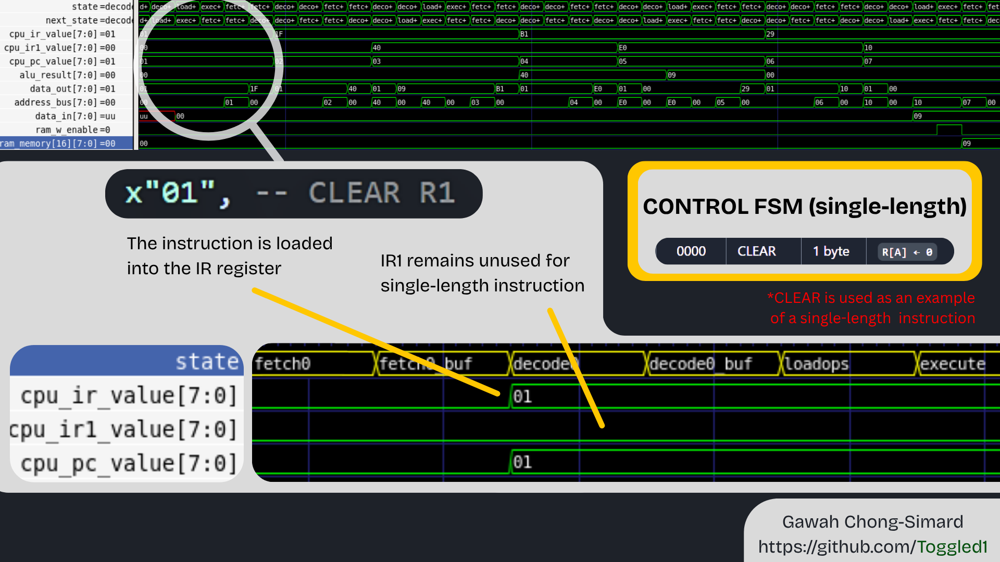
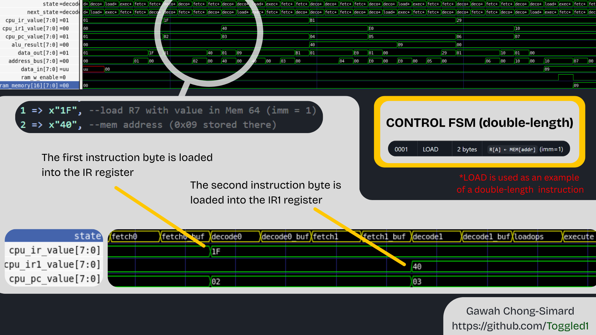

------------------------------------
Basic Architecture Info
------------------------------------
8-bit cpu

8-bit/16bit variable instruction length

sync reset/write registers (async read)

sync sim RAM (sync read)

For now, Programs are just initialized in RAM

------------------------------------
Datapath Info
------------------------------------
datapath connects IR, IR1, PC, SR, and GP registers.

PC increment is done in datapath, but can be controlled by cpu_frame when PC_target is enabled (pc src sel)

IR holds first byte of instruction

IR1 holds second byte of instruction (given a double-length instruction)

wb select chooses between sources for register input source... only 00 (ALU) and 10 (mem) are actually used.

------------------------------------
CPU frame Info
------------------------------------
cpu_frame includes control unit and ram access

FETCH, DECODE, EXECUTE cycle contains intermediate "buffer" steps to wait for the sync ram fetch

For single length (short) instructions:     FETCH0 -> FETCH0_BUF -> DECODE0 -> DECODE0_BUF -> LOADOPS -> EXECUTE

For double length (long) instructions:      FETCH0 -> FETCH0_BUF -> DECODE0 -> DECODE0_BUF -> FETCH1 -> FETCH1_BUF  
                                                 -> DECODE1 -> DECODE1_BUF -> LOADOPS -> EXECUTE

------------------------------------
ALU Info
------------------------------------
    only has cases for operations that actually require ALU (move uses ALU passthrough)

    Evaluates four flags: zero (Z), carry (C), negative (N), overflow (V)
    -- flag temporaries
    variable zero_flag       : std_logic; --Z
    variable carry_flag      : std_logic; --C
    variable negative_flag   : std_logic; --N
    variable overflow_flag   : std_logic; --V

------------------------------------
Instruction Info
------------------------------------
NOTE: imm is applicable to 2-byte (double-length) instructions

### Instruction Format

#### Byte 0

| Bit | 7 | 6 | 5 | 4 | 3   | 2 | 1 | 0 |
|-----|---|---|---|---|-----|---|---|---|
|     | X | X | X | X | imm | A | A | A |

- `XXXX` = Opcode  
- `imm`  = Immediate flag  
- `AAA`  = Destination register select (R[A])

---

#### Byte 1 (imm = 0)

| Bit | 7 | 6 | 5 | 4 | 3 | 2 | 1 | 0 |
|-----|---|---|---|---|---|---|---|---|
|     | B | B | B | – | – | – | – | – |

- `BBB` = Source register select (R[B])  
- `src` = R[B]

---

#### Byte 1 (imm = 1)

| Bit | 7 | 6 | 5 | 4 | 3 | 2 | 1 | 0 |
|-----|---|---|---|---|---|---|---|---|
|     | Y | Y | Y | Y | Y | Y | Y | Y |

- `YYYYYYYY` = 8-bit address  
- `src` = MEM[addr]

| Opcode | OP     | Length  | Scheme |
|:------:|--------|---------|--------|
| 0000   | CLEAR  | 1 byte  | `R[A] ← 0` |
| 0001   | LOAD   | 2 bytes | `R[A] ← MEM[addr]` (imm=1) |
| 0010   | STORE  | 2 bytes | `MEM[addr] ← R[A]` (imm=1) |
| 0011   | MOVE   | 2 bytes | `R[A] ← R[B]` (imm=0) |
| 0100   | BZ     | 2 bytes | `if ZF=1 then PC ← addr` (imm=1) |
| 0101   | BN     | 2 bytes | `if NF=1 then PC ← addr` (imm=1) |
| 0110   | BRANCH | 2 bytes | `PC ← addr` (imm=1) |
| 0111   | OR     | 2 bytes | `R[A] ← R[A] OR src` |
| 1000   | XOR    | 2 bytes | `R[A] ← R[A] XOR src` |
| 1001   | AND    | 2 bytes | `R[A] ← R[A] AND src` |
| 1010   | NOT    | 1 byte  | `R[A] ← NOT R[A]` |
| 1011   | ADD    | 2 bytes | `R[A] ← R[A] + src` |
| 1100   | SUB    | 2 bytes | `R[A] ← R[A] - src` |
| 1101   | INC    | 1 byte  | `R[A] ← R[A] + 1` |
| 1110   | DEC    | 1 byte  | `R[A] ← R[A] - 1` |
| 1111   | NOP    | 1 byte  | `no operation` |

------------------------------------
To run
------------------------------------
ghdl -a --std=08 vhdl/*.vhd tb/*.vhd  
ghdl -e --std=08 cpu_tb  
ghdl -r --std=08 cpu_tb --wave=waves.ghw --stop-time=30us  
gtkwave waves.ghw default.gtkw  

