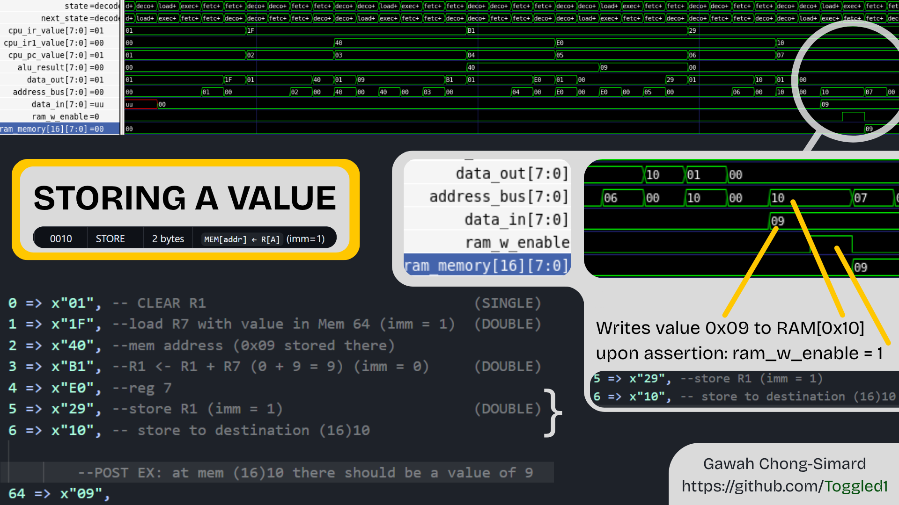
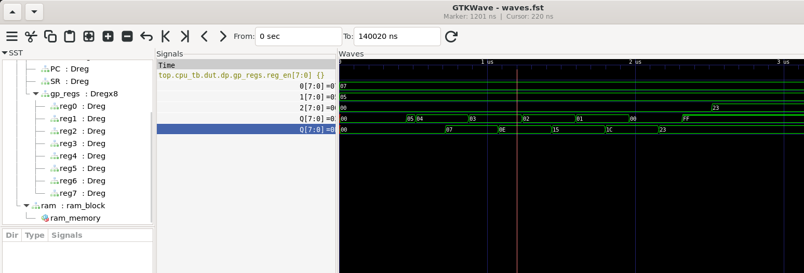

# Custom 8-bit CPU (Variable-Length Instruction Set)

## Project Overview

This is a custom 8-bit CPU I built in VHDL, along with a full toolchain (Python assembler + RAM initialization for simulation).

I was introduced to RTL design in one of my courses last fall, and I got really interested in it, so I decided to start my own small project!

What it supports:
- 8-bit core with a 16-bit variable-length instruction format
- Synchronous RAM (read/write, FPGA-style behavior)
- Register-based datapath with ALU + flag logic
- Multi-cycle FSM (fetch/decode/execute)
- Custom Python assembler that generates machine code

---

## Architecture Overview

### Core Design

- 8-bit datapath CPU
- Variable-length instructions (1-byte and 2-byte formats)
- General-purpose register file (R0–R7)
- Special registers: PC, IR, IR1, Status Register (SR)
- ALU handles arithmetic, logic, and flag generation

---

### Memory System

- Synchronous RAM for both reads and writes (so it behaves like FPGA)
- RAM is initialized from the assembler output file at simulation start
- CPU executes directly from this preloaded memory image

---

## Datapath Design

The datapath connects all the main CPU components:

- Instruction Register (IR)
- Secondary Instruction Register (IR1)
- Program Counter (PC)
- Status Register (SR)
- General Purpose Registers (R0–R7)

Key behaviour:
- PC increment happens in the datapath
- PC can also be overridden by control logic for branches/jumps
- A write-back mux selects between ALU output and memory data

---

## Control Unit (CPU FSM) - "CPU Frame"

The CPU runs on a multi-stage FSM that accounts for synchronous RAM latency. It utilizes Look-Ahead Decoding. Compared to earlier revisions to this FSM, the need for dedicated decode cycles has been eliminated by making opcodes and register selections based directly from the RAM wires during buffer states.

**Take a look!** Below, I spent a LOT of time making this schematic of the finite state machine ;)


### Single-byte instruction cycle:
FETCH0 → FETCH0_BUF → EXECUTE  

### Double-byte instruction cycle:
FETCH0 → FETCH0_BUF → FETCH1 → FETCH1_BUF → [LOADOPS] → EXECUTE  

**Note:** This optimized FSM achieves a variable execution rate of 3 to 6 cycles. The Buffer states perform allow the synchronous RAM output to stabilize while also decoding the incoming instruction bits!

The control unit (CPU frame) handles:
- **Instruction Sequencing:** Routes the FSM based on instruction length (8-bit vs 16-bit).
- **Memory Timing Handling:** Manages the `LOADOPS` and `BUF` states such that the synchronous RAM bus is stable before latching data.
- **Execution Flow Control:** Controls PC increments and write-back signals for the datapath and status registers.

---

## ALU Design

The ALU supports basic arithmetic and logic operations, and also generates standard CPU flags:

- Zero (Z)
- Carry (C)
- Negative (N)
- Overflow (V)

It also has a passthrough mode for operations like MOVE where no real ALU operation is needed.

------------------------------------
Instruction Set Architecture (ISA)
------------------------------------
NOTE: imm is applicable to 2-byte (double-length) instructions

### Instruction Format

#### Byte 0

| Bit | 7 | 6 | 5 | 4 | 3   | 2 | 1 | 0 |
|-----|---|---|---|---|-----|---|---|---|
|     | X | X | X | X | imm | A | A | A |

- `XXXX` = Opcode  
- `imm`  = Immediate flag  
- `AAA`  = Destination register select (R[A])

---

#### Byte 1 (imm = 0)

| Bit | 7 | 6 | 5 | 4 | 3 | 2 | 1 | 0 |
|-----|---|---|---|---|---|---|---|---|
|     | B | B | B | – | – | – | – | – |

- `BBB` = Source register select (R[B])  
- `src` = R[B]

---

#### Byte 1 (imm = 1)

| Bit | 7 | 6 | 5 | 4 | 3 | 2 | 1 | 0 |
|-----|---|---|---|---|---|---|---|---|
|     | Y | Y | Y | Y | Y | Y | Y | Y |

- `YYYYYYYY` = 8-bit address  
- `src` = MEM[addr]


| Opcode | OP     | Length  | Scheme |
|:------:|--------|---------|--------|
| 0000   | CLEAR  | 1 byte  | `R[A] ← 0` |
| 0001   | LOAD   | 2 bytes | `R[A] ← MEM[addr]` (imm=1) |
| 0010   | STORE  | 2 bytes | `MEM[addr] ← R[A]` (imm=1) |
| 0011   | MOVE   | 2 bytes | `R[A] ← R[B]` (imm=0) |
| 0100   | BZ     | 2 bytes | `if ZF=1 then PC ← addr` (imm=1) |
| 0101   | BN     | 2 bytes | `if NF=1 then PC ← addr` (imm=1) |
| 0110   | BRANCH | 2 bytes | `PC ← addr` (imm=1) |
| 0111   | OR     | 2 bytes | `R[A] ← R[A] OR src` |
| 1000   | XOR    | 2 bytes | `R[A] ← R[A] XOR src` |
| 1001   | AND    | 2 bytes | `R[A] ← R[A] AND src` |
| 1010   | NOT    | 1 byte  | `R[A] ← NOT R[A]` |
| 1011   | ADD    | 2 bytes | `R[A] ← R[A] + src` |
| 1100   | SUB    | 2 bytes | `R[A] ← R[A] - src` |
| 1101   | INC    | 1 byte  | `R[A] ← R[A] + 1` |
| 1110   | DEC    | 1 byte  | `R[A] ← R[A] - 1` |
| 1111   | NOP    | 1 byte  | `no operation` |



------------------------------------
To run
------------------------------------
```bash
ghdl -a --std=08 vhdl/*.vhd tb/*.vhd
ghdl -e --std=08 cpu_tb
ghdl -r --std=08 cpu_tb --fst=waves.fst --stop-time=150us
gtkwave waves.fst default.gtkw
```


## Toolchain Overview

This project uses a simple custom toolchain to convert assembly code into CPU-executable machine code in simulation.<br><br>

Assembly → Custom Assembler → Machine Code → RAM Initialization → CPU Execution (GHDL)<br><br>

---

## Custom Assembler

This project includes a custom-built assembler for the CPU architecture.<br>
It translates assembly code into machine code and generates a memory initialization file used by the simulator.<br><br>

### Features

<b>Section-based program layout</b><br>
- <code>.data</code>: initialized variables stored in memory<br>
- <code>.bss</code>: reserved uninitialized memory space<br>
- <code>.text</code>: executable instructions<br><br>

<b>Comments</b><br>
- Anything after <code>#</code> is ignored by the assembler<br><br>

<b>Labels</b><br>
- Supports symbolic labels (e.g. <code>multiply_loop:</code>)<br>
- Labels are resolved to instruction addresses during assembly<br>
- Enables branching with <code>BRANCH</code>, <code>BN</code>, etc.<br><br>

---

## Example Program (Repeated Addition Multiplication)

<pre>

.data
num1 0x07          # Multiplicand: First number to multiply [7]
num2 0x05          # Multiplier: Second number to multiply [5]
prod 0x00          # Variable to store the final product

.text
######## Initialization
CLEAR R2           # R2 will hold our running product, initialize to 0
LOAD R0, num1      # Load the multiplicand into R0
LOAD R1, num2      # Load the multiplier into R1

######## Multiplication Loop
multiply_loop:
DEC R1             # Decrement the multiplier (count--)
BN end_loop        # If the result is negative (was 0 before DEC), exit loop
ADD R2, R0         # Add the multiplicand (R0) to our running product (R2)
BRANCH multiply_loop # Unconditional jump back up to repeat the loop

######## Program End
end_loop:
STORE R2, prod     # Store the final calculated product back into memory
NOP                # Exit
</pre>

---

## Assembler Output (Machine Code)

<pre>
07
05
00
02
18
00
19
01
E1
58
0F
B2
00
68
08
2A
02
F0
</pre>

---

## RAM Integration

The RAM module was modified to load the assembler output file at simulation startup.<br><br>

Execution flow:<br>
Assembly → Assembler → Machine code file → RAM preload → CPU execution<br><br>

- Machine code is written to a file by the assembler<br>
- RAM reads values sequentially using <code>std.textio</code> and <code>ieee.std_logic_textio</code><br>
- CPU executes directly from initialized memory<br><br>

---

## Output Example

The program computes:

<pre>
7 × 5 = 35
</pre>

Result:<br>
- Stored in <code>Memory[0x02]</code><br>
- Value = 35 (decimal)<br>
- Accumulated in <code>R2</code><br><br>

---

## Waveform

